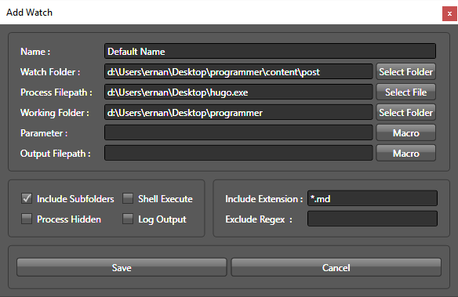

+++
date = "2016-01-30T19:19:19Z"
title = "Tools I use for this Blog"

+++

In this post I am going to share some of the tools I currently use to build the blog.
<!--more-->

It took me quite a while to get started writing this blog, mainly because it is not hosted on [Wordpress](https://wordpress.com/ "Wordpress") and
I did not have a good set of tools to build it. If you are starting a blog and are not interested in all 
the development details I strongly suggest a  [Wordpress](https://wordpress.com/ "Wordpress") approach. 
It simplifies things a lot. 

I aim to eventually build a lot more than just a blog so for me this was not going to work. 

These are the tools I currently use:

1. My editor is [Netbeans](https://https://netbeans.org/downloads/ "Netbeans"). This is really a java ide but it works as a brilliant html editor. 
It is also a top notch Java IDE also. 

2. I host the site on [aws](https://aws.amazon.com/s3/ "aws") in an S3 bucket. I found this a but awkward to configure so one day I will write a step by step
post on how to put a website on an S3 bucket.

3. To generate the blog I use [hugo](https://gohugo.io/ "hugo"). I love this, really I do. This just works and I recommend using this.

4. I write the blog in markdown. IF you are using [hugo](https://gohugo.io/ "hugo") you will need to learn how to write in this format. It is very simple, you
can find a good tutorial here  [markdowntutorial](http://markdowntutorial.com/ "markdowntutorial").

5. To transfer the files to aws I use [s3browser](http://s3browser.com/ "s3browser") this makes is easier to transfer the files and folders to the bucket.

6. To automate the blog generation process I use a [Luba Filewatcher](http://sourceforge.net/projects/luba-filewatcher/ Luba Filewatcher)  

I configured this to watch the posts directory recursively. It then calls hugo to generate the blog.
It would be nice to auto post the blog also but that can come later. 

