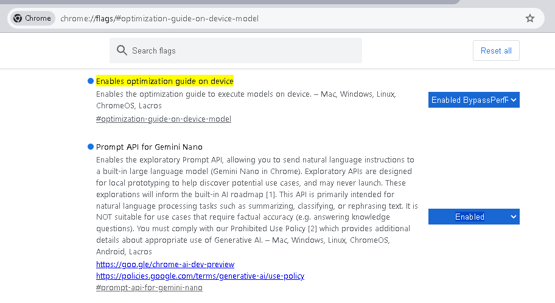

# Chrome AI


AI is coming ot the browser locally. Read about it here: [ai built in](https://developer.chrome.com/docs/ai/built-in).

Sign up [here](https://docs.google.com/forms/d/e/1FAIpQLSfZXeiwj9KO9jMctffHPym88ln12xNWCrVkMY_u06WfSTulQg/viewform)


You can now use a machine learning model in chrome.
To enable this 
1. Install [Chrome Dev](https://www.google.com/chrome/dev/)
2. Change these two flags

```
# set this to Enabled BypassPerfRequirement
chrome://flags/#optimization-guide-on-device-model
# set this to enabled
chrome://flags/#prompt-api-for-gemini-nano
```


3. You will then need to open components and Check for Update on Optimization Guide on Device Model component.


To test if it is working open a console and enter the following code.

```
const session = await window.ai.createTextSession();
const stream = session.promptStreaming('I was born in December 1980 what age am I');
for await (const chunk of stream) { console.log(chunk);} 

```


