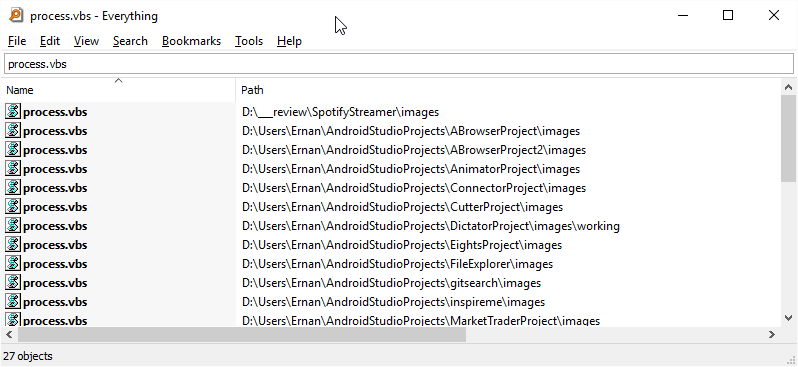

+++
date = "2016-01-31T14:39:14Z"
title = "Everything"

+++

I think that this tool is the best search tool for windows.

[Everything](https://www.voidtools.com/downloads/ "Everything") 

<!--more-->

In nearly every windows installation it is the first tool I install.

It does one thing really well and very fast.

It finds files on your hard drive
 

You can use wildcards 

* * Matches zero or more characters
* ? Matches one characted

for example to find all  excel files on your hard drive you would use **.xls*

 
