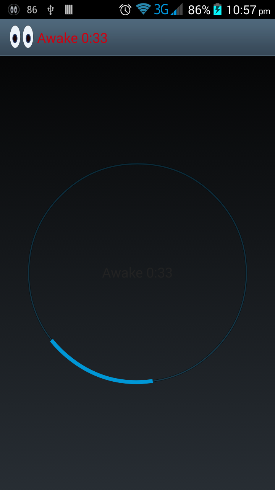

+++
date = "2016-03-08T20:46:38Z"
title = "Project 4: Meth"

+++


This is another simple android application. It does one thing 
It keeps your phone awake.

<!--more-->


For some applications we need to keep the phone awake no matter what. This application is an implementation of that.

You can find the code here [Meth](https://github.com/ernan/meth "Meth")

The GUI uses this really cool progress [https://github.com/Todd-Davies/ProgressWheel](https://github.com/Todd-Davies/ProgressWheel "ProgressWheel") by Todd Davis

This app builds upon a lot of the posts I have already made.

The app uses [EventBus](http://github.com/greenrobot/EventBus "EventBus") to handle user events.

It also uses the [Image Script](blog/image_script.md) to generate the resource images.


Essentially the application is a keep awake service that can be paused and restarted.
In general I would see this app as a support application to another application for example if you wanted to turn your phone into a 
security camera you could run this app in the background keeping your phone awake until it runs low on battery.

The Main class consists of a progress wheel which is updated by the service.
It uses a BroadcastReciever to communicate with the service.

```java

    private BroadcastReceiver broadcastReceiver = new BroadcastReceiver() {
        @Override
        public void onReceive(Context context, Intent intent) {
            Bundle b = intent.getExtras();
            long totalTime = b.getLong(Util.DURATION);
            Spanned text = Html.fromHtml("<font color=\"#CF000F\">Awake " + DateTimeUtil.formatTime(totalTime / 1000) + "</font>");
            if (!pw.isSpinning()) {
                pw.spin();
            }
            pw.setText(text.toString());

            Intent i = new Intent(MainActivity.this, NotificationReceiverActivity.class);
            PendingIntent pIntent = PendingIntent.getActivity(MainActivity.this, 0, i, 0);
            Notification notification = new Notification.Builder(MainActivity.this)
                    .setContentTitle("Device being kept awake")
                    .setContentText("Awake " + DateTimeUtil.formatTime(totalTime / 1000) + "\nClick to let it sleep").setSmallIcon(R.drawable.meth_notification)
                    .setContentIntent(pIntent)
                    .setAutoCancel(true)
                    .build();
            NotificationManager notificationManager = (NotificationManager) getSystemService(NOTIFICATION_SERVICE);
            notificationManager.notify(METH_NOTIFICATION_ID, notification);
            getActionBar().setTitle(text);
        }
    };
    private BroadcastReceiver mBatInfoReceiver = new BroadcastReceiver() {
        @Override
        public void onReceive(final Context context, Intent intent) {
            int level = intent.getIntExtra(BatteryManager.EXTRA_LEVEL, 0);
            int scale = intent.getIntExtra(BatteryManager.EXTRA_SCALE, 100);
            L.i("level: " + level + "; scale: " + scale);
            int percent = (level * 100) / scale;
            L.i("level: " + level + "; scale: " + scale);

            if (percent < 10) {
                meth(false);
                pw.setText("Stopped battery below 10%...");
            }
        }
    };


```

The progress wheel uses the event bus to communicate with the service to turn on and off the wake lock.
There is also a dummy activity here a NotificationReceiverActivity whose purpose is to act as a messenger to the main activity.

The application also allows the user to start and stop the service from the notification tray. 

```java

    @Override
    protected void onCreate(Bundle savedInstanceState) {
        super.onCreate(savedInstanceState);
        setContentView(R.layout.activity_main);
        pw = (ProgressWheel) findViewById(R.id.pw_spinner);
        pw.setOnClickListener(new View.OnClickListener() {
            @Override
            public void onClick(View v) {
                meth(!isOn);
            }
        });
        meth(!getIntent().getBooleanExtra(EXIT, false));
    }

    void meth(boolean onOff) {
        if (onOff) {
            startService(new Intent(this, MethService.class));
            Intent intent = new Intent(this, NotificationReceiverActivity.class);
            PendingIntent pIntent = PendingIntent.getActivity(this, 0, intent, 0);
            Notification noti = new Notification.Builder(this)
                    .setContentTitle("Device being kept awake")
                    .setContentText("Click to let it sleep").setSmallIcon(R.drawable.meth_notification)
                    .setContentIntent(pIntent)
                    .setAutoCancel(true)
                    .build();
            NotificationManager notificationManager = (NotificationManager) getSystemService(NOTIFICATION_SERVICE);
            notificationManager.notify(METH_NOTIFICATION_ID, noti);
            EventBus.getDefault().post(new MethEvent(true));
            isOn = true;
        } else {
            pw.setText("Waiting...");
            getActionBar().setTitle(R.string.app_name);
            pw.stopSpinning();
            NotificationManager notificationManager = (NotificationManager) getSystemService(NOTIFICATION_SERVICE);
            notificationManager.cancel(METH_NOTIFICATION_ID);
            EventBus.getDefault().post(new MethEvent(false));
            isOn = false;
        }
    }

```


This is the service class. Pretty straight forward

1. It acquires a wake lock.
2. It sends a notification to the phone letting you know how long the phone has been kept awake.
3. It checks for a cancel event so that it can pause.

```java

public class MethService extends Service {

    public static final String BROADCAST_ACTION = MethService.class.getName();
    private final Handler handler = new Handler();
    Intent intent;
    long mStartTime = 0l;
    PowerManager.WakeLock mWakeLock = null;
    private boolean isOn = true;
    private Runnable outGoingHandler = new Runnable() {
        public void run() {
            if (isOn) {
                updateHighInfo();
                handler.postDelayed(this, 1010);
            }
        }
    };

    public void updateHighInfo() {
        Bundle b = new Bundle();
        long now = SystemClock.uptimeMillis();
        long totalTime = now - mStartTime;
        b.putLong(Util.DURATION, totalTime);
        try {
            KeyguardManager keyguardManager = (KeyguardManager) getApplicationContext().getSystemService(Context.KEYGUARD_SERVICE);
            KeyguardManager.KeyguardLock keyguardLock = keyguardManager.newKeyguardLock("Meth Service disablig the keyguard");
            keyguardLock.disableKeyguard();

            PowerManager pm = (PowerManager) getSystemService(Context.POWER_SERVICE);
            mWakeLock = pm.newWakeLock(PowerManager.FULL_WAKE_LOCK | PowerManager.ACQUIRE_CAUSES_WAKEUP | PowerManager.ON_AFTER_RELEASE, "Meth keeping machine awake");
            mWakeLock.acquire();
        } catch (Exception e) {
            L.e(e.getMessage());
        }

        intent.putExtras(b);
        sendBroadcast(intent);
    }

    public void onEvent(MethEvent event) {
        isOn = event.isOn;
        if (isOn) {
            handler.removeCallbacks(outGoingHandler);
            mStartTime = SystemClock.uptimeMillis();
            handler.postDelayed(outGoingHandler, 100);
        }
    }

    @Override
    public void onCreate() {
        super.onCreate();
        EventBus.getDefault().register(this);
        intent = new Intent(BROADCAST_ACTION);
        mStartTime = SystemClock.uptimeMillis();
        handler.removeCallbacks(outGoingHandler);
        handler.postDelayed(outGoingHandler, 100);
    }

    @Override
    public void onDestroy() {
        if (mWakeLock != null) {
            mWakeLock.release();
        }
        super.onDestroy();
    }

    @Override
    public IBinder onBind(Intent arg0) {
        return null;
    }
}

```



