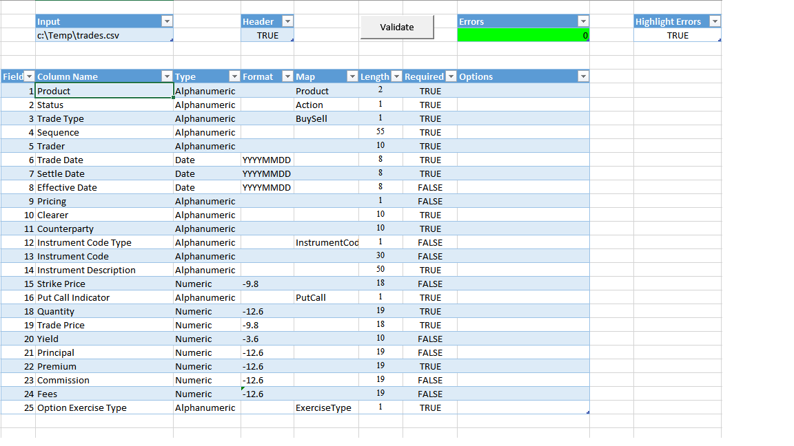
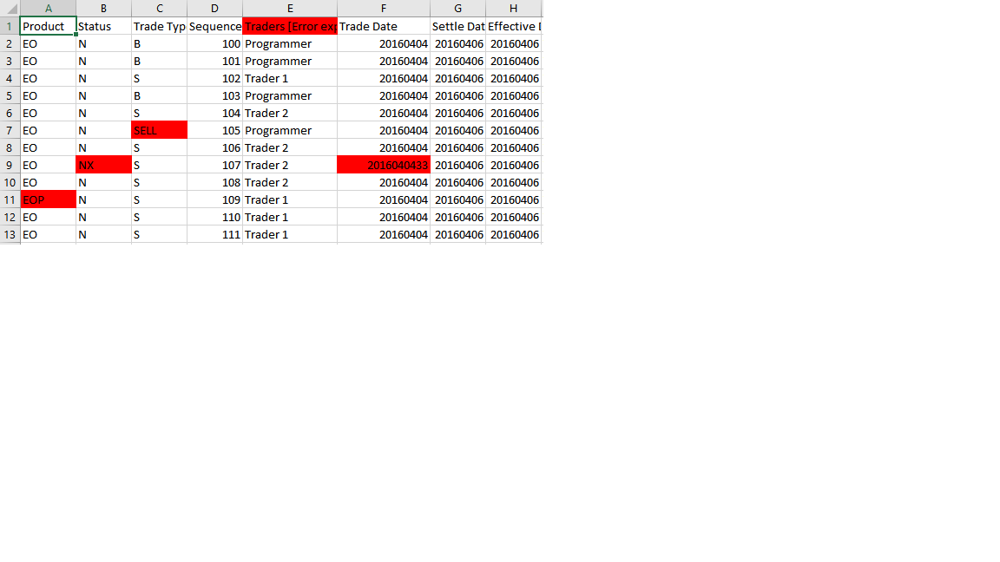

+++
date = "2016-04-28T23:45:48+01:00"
title = "Project 6: Validator"
+++


A validation tool for excel files. Sometimes you need to export data from one system for loading into another. For instance
you may export a report from a derivatives trading system for information for a collateral management system.

This Excel macro file validates input files to make sure that they are in a specific format.
The input file can be in any format that excel can load. The workbook will load the file and check for errors in place.

<!--more-->


The workbook is configurable so it can be used to validate any input.

The workbook currently supports the following validation.

1. It can validate that the correct columns are in the input file.
2. It can validate columns in the file to make sure that they are in the correct date and number format.
3. It can validate that the columns in the file are in a selection list it does this by using a map tab with tables.
4. It can validate that the contents in the columns do not exceed a specific length.
5. It can validate that when a column is required it contains data.


It will show the error count after it has completed running and will highlight which cells in the input failed the validation.




So I will just go through some of the functionality

## Step 1: load the input for processing

The first part is we load the input file for processing

This function loads any valid excel file into the workbook, it will load it into a named tab.
Notice how I delete and recreate the tab at the beginning of the process.
The remove sheet function should just fail silently as the sheet may not exist for deletion.

```vb

Function loadFile(path As String, name As String)
    Dim ws As Worksheet
    Set ws = addSheet(name)
    Dim wbFrom As Workbook
    Set wbFrom = Workbooks.Open(path)
    wbFrom.Sheets(1).Cells.Copy ws.Cells
    wbFrom.Close SaveChanges:=False
    Set loadFile = ws
End Function

Function addSheet(name As String)
    removeSheet name
    Dim ws As Worksheet
    Set ws = ThisWorkbook.Sheets.Add(After:= _
             ThisWorkbook.Sheets(ThisWorkbook.Sheets.Count))
    ws.name = name
    Set addSheet = ws
End Function

Sub removeSheet(name As String)
On Error Resume Next
    ThisWorkbook.Sheets(name).Delete
On Error GoTo 0
End Sub

```

## Step 2: determine the length and breath of the file for processing

To do this I just use the xlCellTypeLastCell to determine the last cell and then get the row and column from that cell

```vb

Dim lastRow As Integer
lastRow = ws.range("A1").SpecialCells(xlCellTypeLastCell).row
Dim lastColumn As Integer
lastColumn = ws.range("A1").SpecialCells(xlCellTypeLastCell).Column


```


## Step 3: Load the mapping table

To handle the mapping table I create a type to hold the configuration.
I then create an array and fill that array with the contents of the mapping table.

These files often are quite large so this is a an attempt to speed things up.
I use a global variable here also because passing the user defined types using varinants does not work. 

```vb

Public Type ValidationItem
    name As String
    typename As String
    format As String
    map As Variant
    length As Integer
    required As Boolean
    options As String
End Type

Public mapItems() As ValidationItem

Sub init()
    Application.DisplayAlerts = False
    Application.ScreenUpdating = False

    Set config = Sheets("Config")
    hasHeader = config.range("HasHeader").Cells(1, 1)
    
    Set maps = CreateObject("Scripting.Dictionary")
    Set mapDateFormats = CreateObject("Scripting.Dictionary")
    Set mapNumberFormats = CreateObject("Scripting.Dictionary")
    
    Dim range As range
    Set range = Sheets("Config").range("Mapping")
    Dim pos As Integer
    pos = 0
    Dim r As Variant
    ReDim Preserve mapItems(range.Rows.Count)
    For Each r In range.Rows
        Dim item As ValidationItem
        item.name = r.Cells(1, 2)
        item.typename = r.Cells(1, 3)
        item.format = r.Cells(1, 4)
        If r.Cells(1, 5) <> "" Then
            Set item.map = loadMap(r.Cells(1, 5))
        Else
            Set item.map = Nothing
        End If
        item.length = r.Cells(1, 6)
        item.required = r.Cells(1, 7)
        item.options = r.Cells(1, 8)
        mapItems(pos) = item
        pos = pos + 1
    Next
    
    Dim ip As String
    ip = config.range("Input").Cells(1, 1)
    Set ws = loadFile(ip, "Result")
    ws.Activate
    errorCount = 0
End Sub

```


## Step 4: if the input has headers validate that they are in the correct order and match the specification

Here we just iterate over the headers and match them to the ValidationItem at each position.
Notice how we have o use 0 based arrays as against 1 based rows and columns.

```vb

    Dim col As Integer
    If hasHeader Then
        For col = 1 To lastColumn
            If Not isValidHeader(ws.Cells(1, col), mapItems(col - 1)) Then
                errorCount = errorCount + 1
                If highlight Then
                    ws.Cells(1, col) = ws.Cells(1, col) & " [Error expecting: " & mapItems(col - 1).name & " ]"
                    ws.Cells(1, col).Interior.Color = RGB(255, 0, 0)
                End If
            End If
        Next
        startRow = 2
    End If

    
Function isValidHeader(val As Variant, item As ValidationItem)
    isValidHeader = (val = item.name)
End Function


```


## Step 5: We iterate over each item in the data and validate it against the mapping table

Not much here we are just processing the input cell by cell and checking it against the mapping table.

```vb

    Dim row As Integer
    For row = startRow To lastRow
        For col = 1 To lastColumn
            If Not isValid(row, col, mapItems(col - 1)) Then
                errorCount = errorCount + 1
                If highlight Then
                    ws.Cells(row, col).Interior.Color = RGB(255, 0, 0)
                End If
            End If
        Next
    Next

```


## Step 6: Validate each cell against its ValidationItem

The process here is to check if it is required first, so if it is required and it is empty well we have an issue.
Next we see if there is a map selected for the item. If there is a map we check the cell value to make sure that it 
is one of the mapped values.
Next we check if the mapping is a date and that the format of that date matches the format specified. 
The validate date function is really awkward so I will not go into the details here.
Dates cause a lot of issues in excel.


```vb

Function isValid(row As Integer, col As Integer, item As ValidationItem)
    isValid = True
    Dim val As String
    val = ws.Cells(row, col)
    If val = "" Then
        If item.required Then
            isValid = False
            Debug.Print "[" & row & "," & col & "] is empty and required"
            Exit Function
        End If
    Else
        If Not item.map Is Nothing Then
            If Not keyExists(item.map, val) Then
                isValid = False
                Debug.Print "[" & row & "," & col & "] => " & val & " is not one of " & dump(item.map)
                Exit Function
            End If
        Else
            Select Case item.typename
                Case "Date":
                    isValid = validateDate(val, item.format)
                    If Not isValid Then
                        Debug.Print "[" & row & "," & col & "] => " & val & " not formatted " & item.format
                        Exit Function
                    End If
                Case "Numeric":
                    isValid = IsNumeric(val)
                    If Not isValid Then
                        Debug.Print "[" & row & "," & col & "] is " & val & " not numeric"
                        Exit Function
                    End If
            End Select
        End If
        
        If Len(val) > item.length Then
            isValid = False
            Debug.Print "[" & row & "," & col & "] length " & Len(val) & " is too long: " & item.length
            Exit Function
        End If
    End If
End Function

```


## Step 7: Show the errors and where they occur

The solution will show which field has an error. It will also output a message showing what is wrong.



